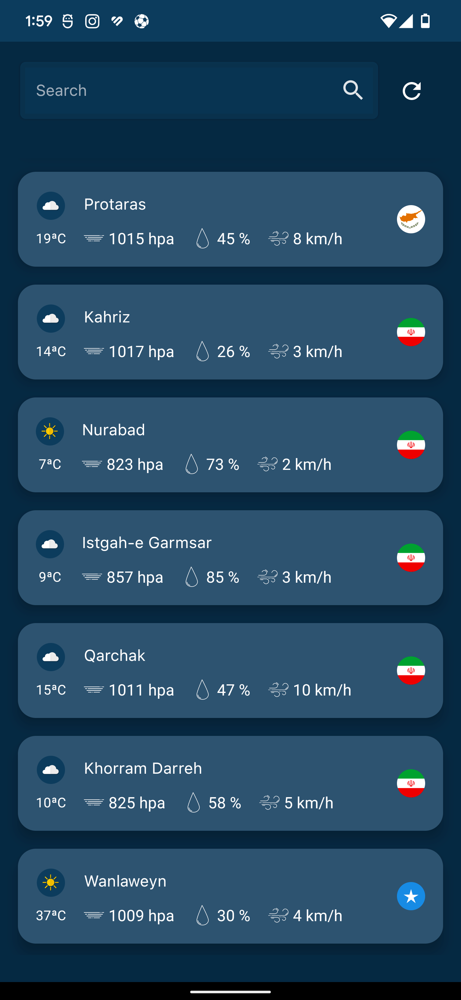
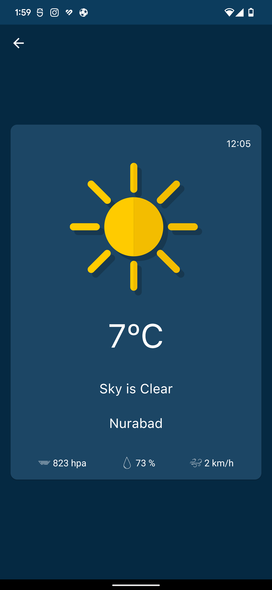
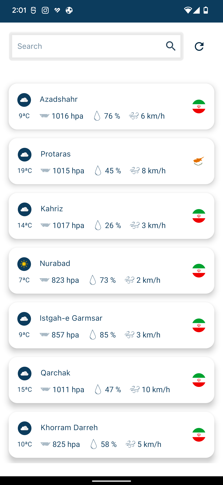
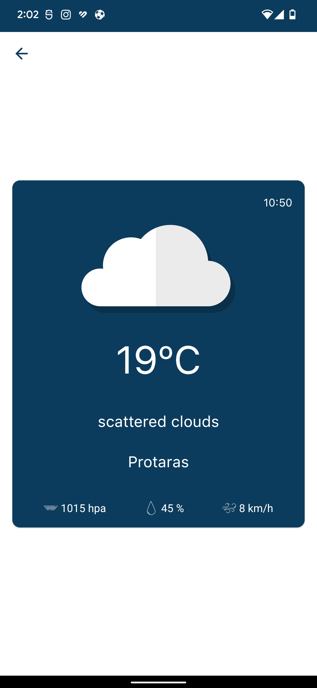

# Weather Test

## Screenshots

built with [Jetpack Compose][compose].

## Architecture
The app is built using MVI pattern with clean architecture, where each UI 'screen' has its own [ViewModel][viewmodel], 
which exposes a single [StateFlow][stateflow] containing the entire view state.
Each [ViewModel][viewmodel] is responsible for subscribing to any data streams required for the view,
as well as exposing functions which allow the UI to send events.

* [Retrofit] for network requests
* [Room] for local database, and i used [Paging3] for pagination
* [Dagger hilt] for dependency injection
* Images are loaded using [Coil][coil] library.
* App supports Light and dark theme

## Data
the json file is uploaded on github

